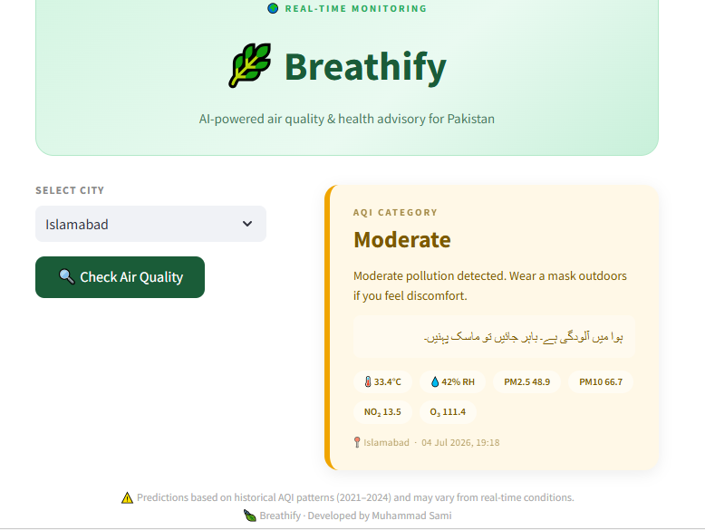
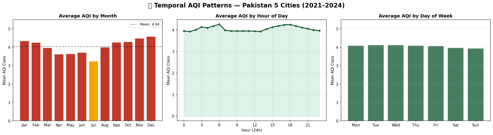
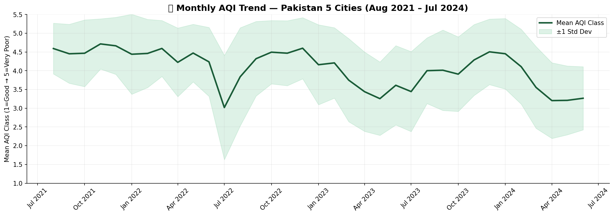
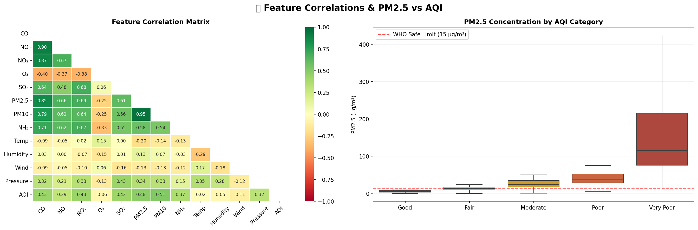
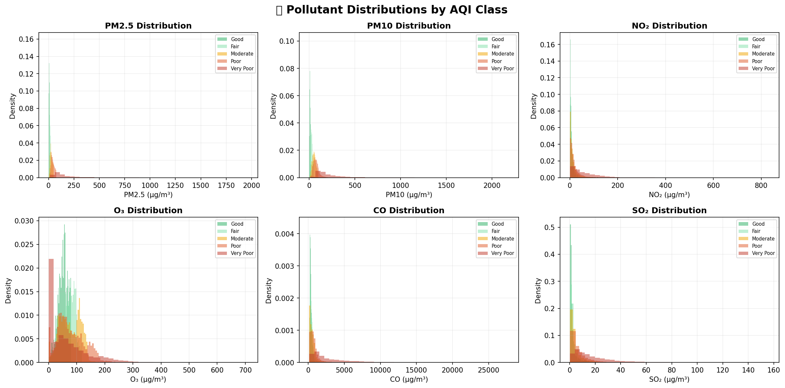
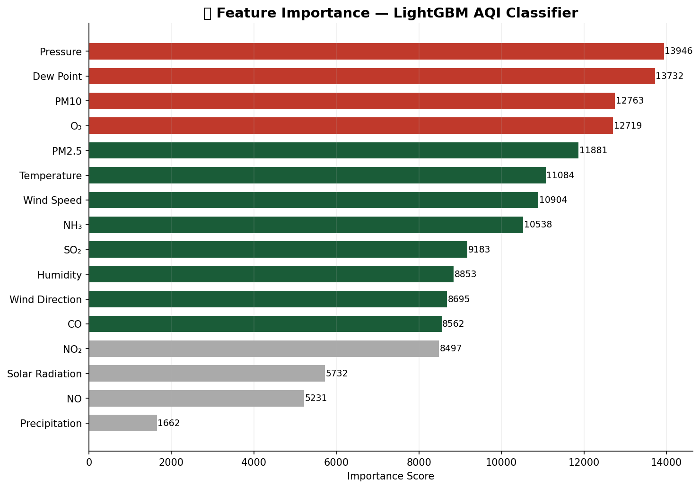

# 🌿 Breathify — AI-Powered Air Quality Advisory for Pakistan

[](https://python.org)
[](https://lightgbm.readthedocs.io)
[](https://streamlit.io)
[]()
[]()

> Real-time AQI prediction and bilingual health advisory for Pakistan's five major cities — powered by LightGBM trained on 3 years of hourly pollutant and meteorological data.

---

## 🎯 Problem Statement

Karachi, Lahore, and Peshawar consistently rank among the world's most polluted cities, yet most residents have no visibility into current air quality or what it means for their health. Breathify bridges this gap: select your city, get an instant AI-predicted AQI category, and receive a health advisory in both English and Urdu.

---

## 📸 Demo



---

## 📊 Model Performance

| Metric | Score |
|---|---|
| Validation Accuracy | **92.75%** |
| Macro F1-Score | **0.9287** |
| Macro Precision | **0.9235** |
| Macro Recall | **0.9345** |
| Avg Prediction Confidence | **92.2%** |

**Per-class F1 breakdown:**

| AQI Class | F1-Score |
|---|---|
| Good (1) | 0.9684 |
| Fair (2) | 0.9558 |
| Moderate (3) | 0.8959 |
| Poor (4) | 0.8568 |
| Very Poor (5) | 0.9667 |

---

## 🏗️ Architecture

```
Live API Call (OpenWeatherMap + Open-Meteo)
        ↓
  16 Features Extracted
  (8 pollutants + 8 weather variables)
        ↓
  StandardScaler (fitted on training data)
        ↓
  LightGBM Classifier
  (class_weight='balanced', 500 estimators)
        ↓
  AQI Class (1–5) + Bilingual Health Advisory
```

---

## 🧪 Dataset

| Property | Detail |
|---|---|
| Source | OpenWeatherMap Air Pollution API |
| Period | August 2021 – July 2024 (3 years) |
| Size | 123,134 hourly records |
| Features | 16 (8 pollutants + 8 weather variables) |
| Target | AQI Class (1=Good → 5=Very Poor) |
| Cities | Karachi, Lahore, Islamabad, Peshawar, Quetta |

**Features used:**

| Pollutants | Weather |
|---|---|
| PM2.5, PM10, CO, NO, NO₂, O₃, SO₂, NH₃ | Temperature, Humidity, Dew Point, Precipitation, Pressure, Wind Speed, Wind Direction, Solar Radiation |

---

## 🔬 EDA & Key Findings

### Temporal Patterns


- **Monsoon is the only relief**: July–August are the only months where AQI drops below "Poor" across all five cities — monsoon rains wash pollutants from the atmosphere
- **Pollution is structural, not activity-driven**: AQI shows almost zero variation by hour of day or day of week — this is not rush-hour pollution, it is persistent industrial and vehicular emission load

### Year-over-Year Trend


- Clear annual dip every July–August across all three years — consistent monsoon signature
- AQI shows gradual improvement year-over-year: 2024 summer is measurably cleaner than 2022
- High variance in winter months (wide std dev band) — some winter days are extremely severe due to temperature inversion events

### Feature Correlations & WHO Limits


- PM2.5 and PM10 correlate most strongly with AQI class (r = 0.48, 0.51)
- **Every AQI class above "Good" has a median PM2.5 exceeding WHO's safe limit of 15 μg/m³**
- "Very Poor" class median PM2.5 is ~150 μg/m³ — 10x the WHO safe limit

### Pollutant Distributions


- PM2.5 and PM10 show the clearest class separation with long right tails only in Very Poor
- O₃ shows an **inverse pattern** — higher ozone in cleaner air classes, lower in Very Poor (ozone is consumed in reactions with pollutants)
- CO distributions overlap heavily across all classes — weak standalone predictor

### Feature Importance


- **Pressure and Dew Point are the top two predictors** — above PM2.5 and PM10
- This is meteorologically valid: atmospheric pressure and dew point drive temperature inversion events, which trap pollutants close to ground level. The model learned real atmospheric physics
- Precipitation is the least important feature — rain is rare in Pakistan so it explains almost nothing

---

## 🛠️ Tech Stack

| Layer | Tools |
|---|---|
| ML Model | LightGBM (multi-class classification) |
| Imbalance Handling | class_weight='balanced' (outperformed SMOTE by +1.76% accuracy) |
| Preprocessing | StandardScaler |
| Live Data | OpenWeatherMap API, Open-Meteo API |
| App | Streamlit |
| Serialization | joblib |
| Language | Python 3.9+ |

---

## 🚀 Getting Started

### 1. Clone the repo
```bash
git clone https://github.com/yourusername/breathify.git
cd breathify
```

### 2. Install dependencies
```bash
pip install -r requirements.txt
```

### 3. Set your API key
Replace `YOUR_API_KEY_HERE` in `app.py` with your OpenWeatherMap key.
Get a free key at [openweathermap.org](https://openweathermap.org/api)

### 4. Run the app
```bash
streamlit run app.py
```

---

---

## ⚠️ Limitations

- Predictions based on historical AQI patterns (2021–2024) and may vary from real-time conditions
- Optimized for Pakistan's five major cities: Karachi, Lahore, Islamabad, Peshawar, Quetta
- Not a substitute for official PEPA or NEQS air quality monitoring

---

## 👤 Author

**Muhammad Sami**
BS Data Science
[LinkedIn](https://www.linkedin.com/in/muhammad-sami-4b5008298 ) · [GitHub](https://github.com/Muhammad-Sami7  )

---

## 📄 License

MIT License — free to use, modify, and distribute with attribution.
